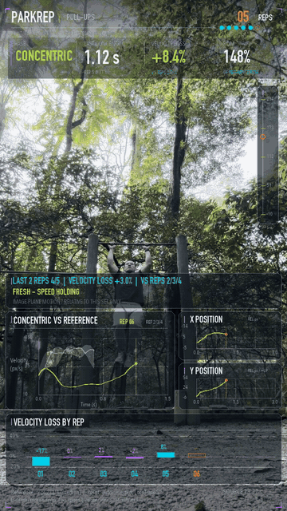
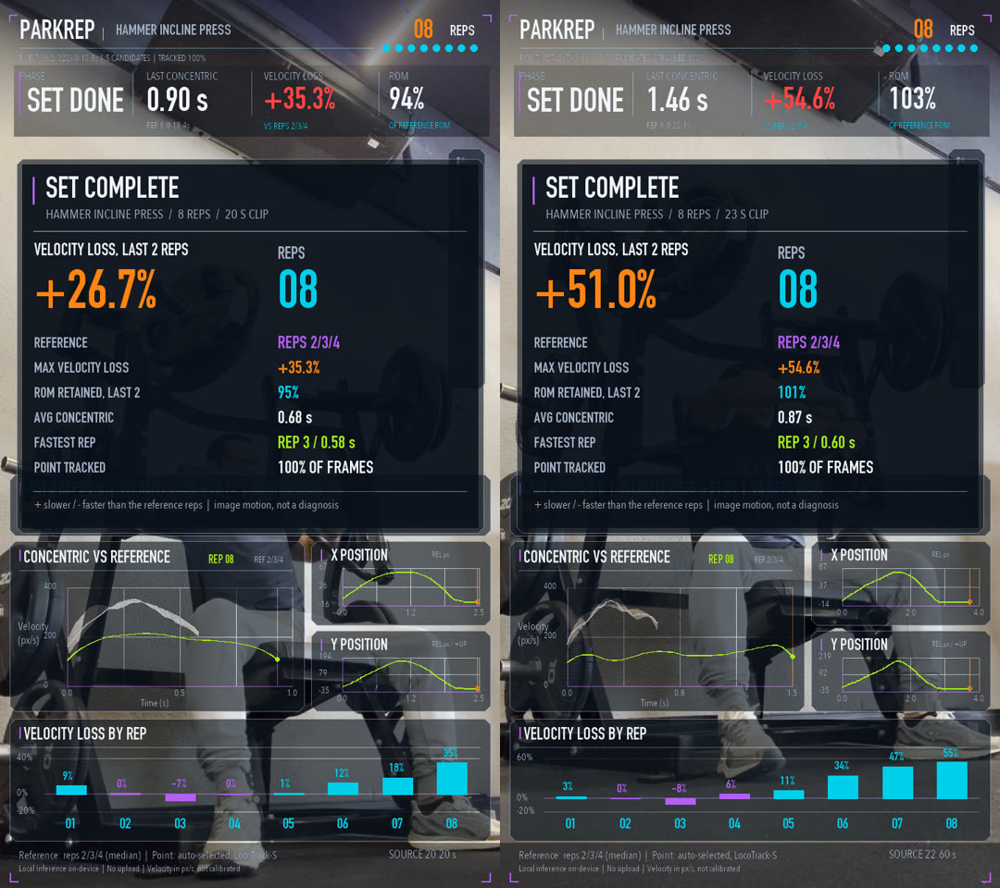

# ParkRep

Film your set at the park with your phone. Back home, one command turns the clip into an
Evangelion-style HUD video: reps counted, speed per rep, and how much you slowed down by the end.
Everything runs locally on a laptop (tested on a MacBook Air M3, 16 GB). Nothing is uploaded.

<p align="center"></p>

A rep count tells you what you did, not what it cost. Two sets of 80 kg × 8 on a Hammer incline
press look the same in a training log. On video, the first lost 27% of its speed over the last two
reps and the second lost 51%. I had logged them as RPE 7 and RPE 8.



```bash
scripts/fetch_weights.sh            # LocoTrack-S weights, ~33 MB, checksum verified
uv sync
uv run parkrep my_pullups.mov --title "Pull-ups"
# -> out/my_pullups_parkrep.mp4, out/my_pullups_summary.json, out/my_pullups_summary.png
```

Requires `ffmpeg` (`brew install ffmpeg`) and Python 3.11–3.12.

## How it works

1. **Mesh (light model).** Lucas–Kanade optical flow on a texture-adapted grid of points
   follows everything that moves. Each trajectory is scored by how much it moves back and forth
   along one axis, after removing camera shake. The top candidates become queries.
2. **Neural tracker (open weights).** [LocoTrack-S](https://github.com/cvlab-kaist/locotrack)
   (Apache-2.0) tracks every candidate through the whole clip on Apple's GPU (MPS). The clip is
   cut into overlapping chunks so memory stays bounded; each chunk is encoded once and shared by
   all candidates. The track whose main run of reps is longest, largest, most regular and
   least mixed with adjustment moves wins; candidates stuck at the frame border are penalized.
3. **Rep logic.** The point is smoothed, projected on its main axis (+ = up on screen) and split
   into moves with prominence hysteresis, so wobbles at a sticking point do not add reps.
   Moves that do not fit the set (a different range, a different start *and* top level, an
   isolated move far from the rhythm, or a move that never comes back down) are labelled
   **adjustments** (setup, sitting back, standing up) and are not counted. Slow reps at the end
   of a set are never dropped for being slow: that slowdown is what is being measured.
   Reps 2–4 are the fixed reference (the first rep is often slower or starts from a stretch);
   every rep is compared to them: velocity loss = 1 − mean concentric speed / reference speed.
   The concentric is timed between 5% and 95% of the rep's range, so a pause at the top or
   bottom does not count as slow lifting; absolute times read shorter than the full motion.
4. **HUD.** Each frame only shows what was knowable at that moment: a rep's numbers appear when
   its top is reached. A summary card closes the video.

## Options

| Flag | Meaning |
| --- | --- |
| `--title` | Exercise name in the HUD |
| `--point X Y --frame N` | Track this pixel instead of auto-selecting |
| `--roi X Y W H` | Only look for the moving point inside this box |
| `--candidates N` | Points tried by the neural tracker (1–8, default 5) |
| `--device auto/mps/cpu` | Torch device |
| `--save-candidates` | Also save every candidate track (for `scripts/eval_clips.py`) |
| `--no-video` | Skip the HUD video and summary card |

## Limits

Speeds are image-plane pixels per second, not m/s; compare reps within one clip only.
When the result is doubtful (point visible in < 80% of frames, tracking lost for a stretch,
reps that move only a few pixels, adjustments, or no regular set) the video shows
**LOW CONFIDENCE** and the summary card lists why.
Keep the phone still and the moving part (bar, hands, hips) visible. Velocity loss describes
the video; it is not a diagnosis of failure, RIR or RPE.

## License

Apache-2.0. `parkrep/locotrack/` is vendored LocoTrack model code (Apache-2.0, commit 3385a23).

## Evaluation and future work

Two real gym sessions (25 clips) are checked against the sets logged in Hevy with
`scripts/eval_clips.py` (it replays cached candidate tracks, no GPU needed). Current result:
20 of 25 rep counts match, and every clip with a wrong count carries a warning.
Outdoors, a set of pull-ups filmed in a park (portrait, 26 s) counts 7 of 7 and ignores the
dismount; an independent trace of the shirt's height finds the same 7 tops. The open items,
with evidence, are in [BACKLOG.md](BACKLOG.md); the main ones:

- **Candidate selection.** All remaining wrong counts come from a point that leaves the frame or
  sits on the wrong body part (thigh instead of arm, knee at the border).
- **Concentric direction.** The code assumes "up on screen" is the concentric phase; rows and
  lateral raises filmed from the front barely move vertically. Add `--concentric` or detect it.
- **Racking after the last rep.** The last RDL rep can include walking the bar to the rack.
